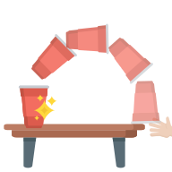
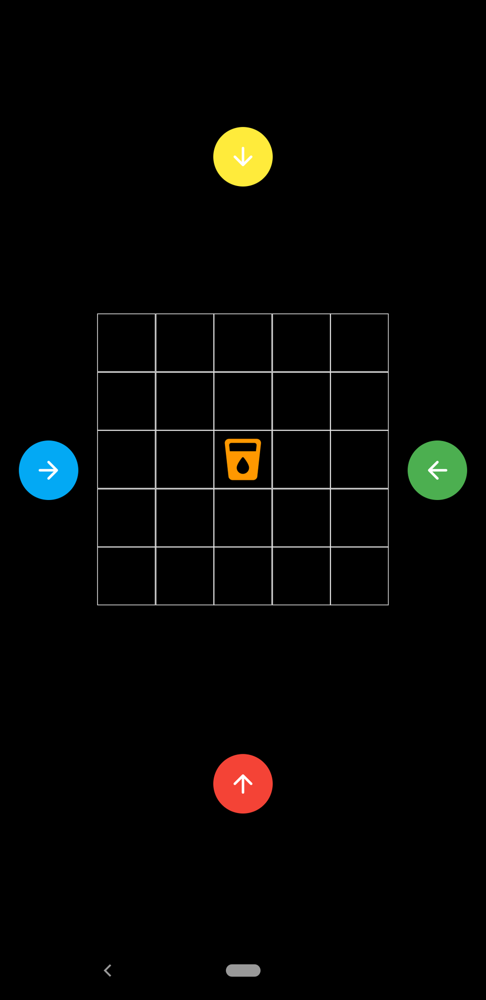
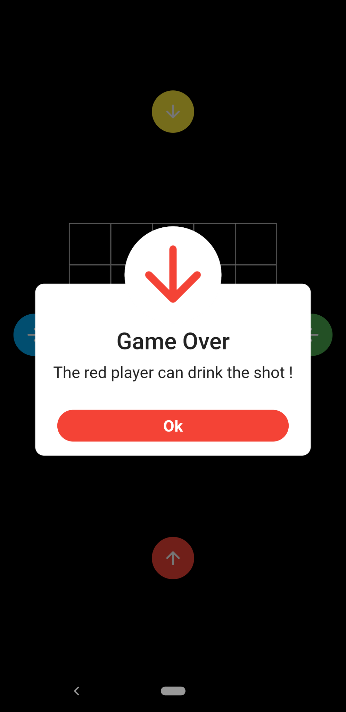

# Red Cup Flip Board
This alcohol game is also called batavia downs flip cup , tip cup, canoe, taps, flippy cup or tippy cup

    

## How to play ? => https://www.youtube.com/shorts/j_pi8T_ZPZo
1. The game takes place around a circular table and requires a minimum of 4 players and 4 cups.
2. 2 players standing opposite of each other, start at the same time.
3. After each successful flip, the drink at the middle of the table is going in the opposite way of the player who flipped the cup.
4. If the drink go out of the square board, the closer player drink it !

